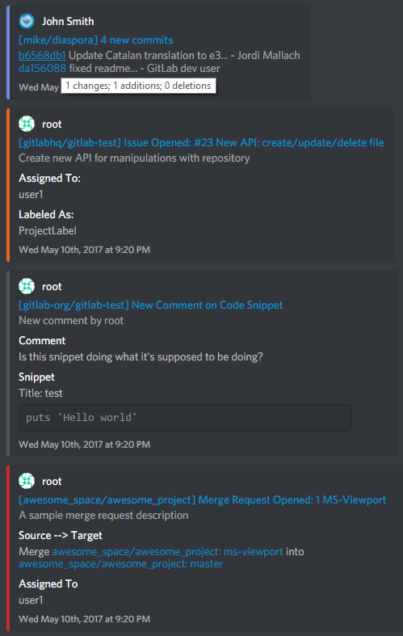

[](https://discord.gg/tZWqhWd)

# Discord-GitLab Webhook Bot

A Discord bot for using webhooks with GitLab (and extendable for other custom webhooks not yet built into Discord).



## GitLab Event Support
* Push Events
* Issue Events
* Comment Events
    * Commits
    * Merge Requests
    * Issues
    * Code Snippets
* Merge Request Events
* Wiki Page Events
* Tag Events (Not yet)
* Pipeline Events (Not yet)
* Build Events (Not yet)


## Installation

1. Clone this repo
2. Install [NodeJS](https://nodejs.org/en/download/)
3. Navigate to the cloned repo
4. Initialize the NodeJS app with npm install
5. All of the dependencies listed in **package.json** should automatically be installed to **node_modules/**
6. Install [pm2](http://pm2.keymetrics.io/) using `npm install pm2@latest -g`
7. Update pm2

### Command Line Summary

```
# make a parent directory for containing the repo, if desired
mkdir my_bots
# navigate to your desired directory
cd my_bots
# either clone via HTTPS
git clone https://github.com/Warped2713/Discord-GitLab-Webhook.git
# ... or clone via SSH
git clone git@github.com:Warped2713/Discord-GitLab-Webhook.git
# navigate to the cloned repo
cd discord-gitlab-webhook
# install the app via NodeJS, using package.json
npm install
# install pm2
npm install pm2@latest -g
# update pm2
pm2 update
```

### Dependencies

The **package.json** file includes the following dependencies:
* [discordJS](https://github.com/hydrabolt/discord.js/) for integrating with Discord
    * [erlpack](https://github.com/hammerandchisel/erlpack) for much faster websockets
* [pm2](http://pm2.keymetrics.io/docs/usage/quick-start/#cheat-sheet) for monitoring and maintaining uptime


## Configuration

1. Create your Discord Bot at https://discordapp.com/developers/applications/me Keep this tab open so you can easily access Client ID and Client Secret
2. Make your Discord app a Bot User by clicking the "Create Bot User" button in your app page settings.
3. Calculated the desired permissions for your bot at https://discordapi.com/permissions.html (or use the default 536964096)
4. Authorize your Discord Bot for your server using `https://discordapp.com/oauth2/authorize?client_id={YOUR_CLIENT_ID}&scope=bot&permissions={YOUR_CALCULATED_PERMISSIONS}` NOTE: if you get "Unexpected Error" then you probably forgot to turn your Discord App into a Bot User in Step 2.
5. In your local bot repo, copy the dev/require/config-dummy.json to dev/require/config.json and fill in the data according to the instructions
6. In your local GitLab server, set up a new webhook using your chosen URL (server.address:server.port), and the DGW_WEBHOOK_TOKEN (or webhook.token) specified in your config file.
7. Run the bot using `pm2 start server.js --name dgw-bot` or simply `node server.js` if you don't want to use pm2
8. Test the webhook by clicking the 'Test' button in GitLab's integrations page

### Using Environment Variables for Secret Tokens (optional)

Instead of keeping your secret tokens in a file, you can choose to set up environment variables and export them for use with the bot script

```
echo $DGW_BOT_TOKEN
export DGW_BOT_TOKEN=MySecretDiscordBotToken
echo $DGW_BOT_TOKEN

echo $DGW_WEBHOOK_TOKEN
export DGW_WEBHOOK_TOKEN=MySecretWebhookToken
echo $DGW_WEBHOOK_TOKEN
```

## Sending Test HTTP Requests

### Use GitLab's Tests

In your GitLab instance (either on the web or on your own server), go to `Settings > Integrations` and find (or create) your webhook. Use the drop-down menu next to your webhook's details to test different event types.

Note that some events will require additional setup on your GitLab instance, such as a `.gitlab-ci.yml` script for your Pipeline and Job events, and an initial wiki page for your wiki events.

### Run the client script

To test HTTP Requests, you can modify and use the client script, `ex-client.js`:

```
pm2 start server.js
node ex-client.js
```

### Run cURL

If you want to test HTTP Requests without a GitLab setup, you can use [cURL](https://curl.haxx.se/) to send fake requests with sample data:

```
cat sample/push.json | curl -i -v -X POST localhost:9000 -H "Content-Type: application/json" -H 'X-Gitlab-Token: TOKEN' -H 'X-Gitlab-Event: Push Hook' --data-binary "@-"
```

* `sample/push.json` refers to the sample data in the local repo
* `localhost:9000` corresponds to the server.address and server.port in your config file
* `TOKEN` is your webhook.token or environment variable DGW_WEBHOOK_TOKEN that you get from Discord when you create/edit a webhook
* `Push Hook` is the event that corresponds to the type of data you send, in this case, a [GitLab Push Hook](https://docs.gitlab.com/ce/user/project/integrations/webhooks.html#push-events)


## Bot Commands

### Debug Mode

`>debug` or `>debug false`

Tell the bot whether or not to enter Debug mode. When in Debug mode, any incoming GitLab HTTP requests received by the bot's HTTP server will be printed to your `#debug-channel` in your Discord server. This can be helpful for figuring out why the data might not be properly displayed by the webhook's embed messages, but can also spam your channel if the data is very long. Only a master user is allowed to use this command.


### Clear (Bulk Delete) Messages

`>clear NUM #CHANNEL`

Deletes the specified number of messages from the mentioned channel.  Only messages from the most recent two weeks will be deleted, as specified by the DiscordAPI.  Both the bot and the user must have permission to "Manage Messages" for the specified channel.  Also replies to the user to acknowledge receiving the command.

* NUM must be a number greater than or equal to 2 and less than 100
* #CHANNEL must be a valid text channel in your guild/server


### Disconnect Bot

`>disconnect TIME`

Tell the bot to stay logged out for TIME milliseconds (default is 5 seconds, max is 1 hour).  The bot should automatically log itself back in after TIME is up.  Only a master user is allowed to use this command. No commands will be processed during the timeout, but the server will still attempt to listen for incoming HTTP requests (which the bot will try to process when it logs back in).


### Embed Sample Data

`>embed TYPE`

Sends an embedded message via webhook, using data read from the specified sample file. Also replies to the user to acknowledge receiving the command.

TYPE must be one of the properties of the SAMPLE object:
* `build`  Reads from `sample/build.json`, which is the body of a [GitLab Build Hook](https://docs.gitlab.com/ce/user/project/integrations/webhooks.html#build-events)
* `issue`  Reads from `sample/issue.json`, which is the body of a [GitLab Issue Hook](https://docs.gitlab.com/ce/user/project/integrations/webhooks.html#issues-events)
* `merge`  Reads from `sample/merge.json`, which is the body of a [GitLab Merge Request Hook](https://docs.gitlab.com/ce/user/project/integrations/webhooks.html#merge-request-events)
* `commit_comment`  Reads from `sample/note-commit.json`, which is the body of a [GitLab Note Hook for Commits](https://docs.gitlab.com/ce/user/project/integrations/webhooks.html#comment-on-commit)
* `issue_comment`  Reads from `sample/note-comment.json`, which is the body of a [GitLab Note Hook for Issues](https://docs.gitlab.com/ce/user/project/integrations/webhooks.html#comment-on-issue)
* `merge_comment`  Reads from `sample/note-merge.json`, which is the body of a [GitLab Note Hook for Merge Requests](https://docs.gitlab.com/ce/user/project/integrations/webhooks.html#comment-on-merge-request)
* `snippet`  Reads from `sample/note-snippet.json`, which is the body of a [GitLab Note Hook for Code Snippets](https://docs.gitlab.com/ce/user/project/integrations/webhooks.html#comment-on-code-snippet)
* `pipeline`  Reads from `sample/pipeline.json`, which is the body of a [GitLab Pipeline Hook](https://docs.gitlab.com/ce/user/project/integrations/webhooks.html#pipeline-events)
* `push`  Reads from `sample/push.json`, which is the body of a [GitLab Push Hook](https://docs.gitlab.com/ce/user/project/integrations/webhooks.html#push-events)
* `tag`  Reads from `sample/tag.json`, which is the body of a [GitLab Tag Hook](https://docs.gitlab.com/ce/user/project/integrations/webhooks.html#tag-events)
* `wiki`  Reads from `sample/wiki.json`, which is the body of a [GitLab Wiki Page Hook](https://docs.gitlab.com/ce/user/project/integrations/webhooks.html#wiki-page-events)
* `unrelated`  Reads from `sample/unrelated.json`, which is just [random JSON data](http://www.json-generator.com/)
* `fake_error`  Purposefully attempts to read undefined data in order to test the error handler


### Ping-Pong

`>ping`

Sends "pong" to the same channel in which the command was called.

### Test Embed

`>test`

Sends an embedded message via webhook, using some placeholder RichEmbed data with Markdown formatting. Also replies to the user to acknowledge receiving the command.
